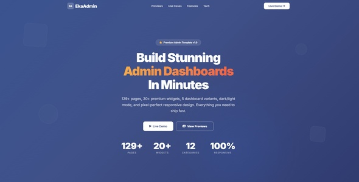
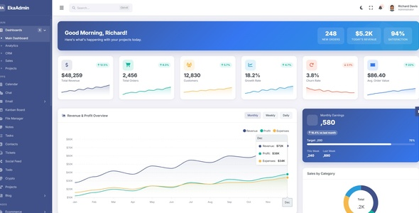
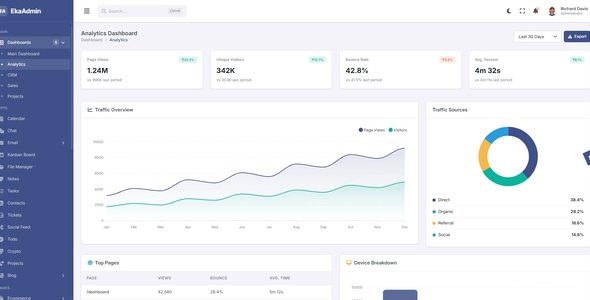
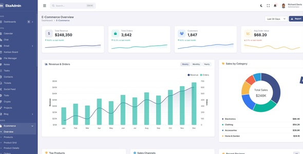
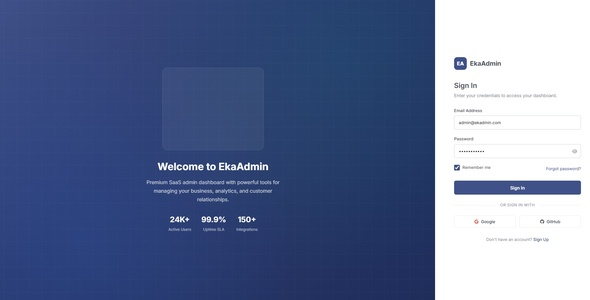
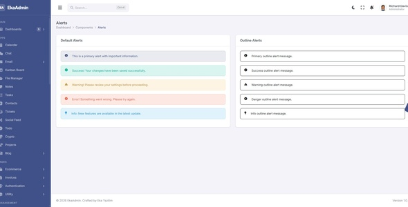

<p align="center">
  
</p>

<h1 align="center">🚀 EkaAdmin — Premium SaaS Admin Dashboard Template</h1>

<p align="center">
  <strong>129+ Pages · 5 Dashboard Variants · Dark/Light Mode · Fully Responsive · Zero Dependencies</strong>
</p>

<p align="center">
  <a href="https://eka-admin.ekayazilim.com.tr/"></a>
  <a href="https://github.com/ekayazilim"></a>
  <a href="#license"></a>
</p>

<p align="center">
  
  
  
  
  
  
</p>

---

## ⭐ Love EkaAdmin? Give us a Star!

If you find EkaAdmin useful, please consider **giving it a star** ⭐ on GitHub — it helps us grow and motivates continued development!

[](https://github.com/ekayazilim/free-saas-admin-template)
[](https://github.com/ekayazilim/free-saas-admin-template/fork)

---

## 📸 Screenshots

<p align="center">
  
  
</p>
<p align="center">
  
  
</p>
<p align="center">
  
</p>

> 🔗 **[View Full Live Demo →](https://eka-admin.ekayazilim.com.tr/)**

---

## 🎯 What is EkaAdmin?

**EkaAdmin** is a **premium, production-ready** HTML5 admin dashboard template designed for SaaS platforms, CRM systems, e-commerce backends, analytics dashboards, and internal tools. Built with pure **HTML5, CSS3, and Vanilla JavaScript** — no framework lock-in, no build tools, no npm required.

### Why EkaAdmin?

| Feature | Details |
|---------|---------|
| 🎨 **Premium Design** | Pixel-perfect UI with modern glassmorphism and clean aesthetics |
| 📱 **Fully Responsive** | Flawless experience on desktop, tablet, and mobile devices |
| 🌙 **Dark / Light Mode** | Persistent theme switching with localStorage support |
| 📊 **5 Dashboard Variants** | Main, Analytics, CRM, Sales, and Projects dashboards |
| 🛒 **E-Commerce Suite** | 16 pages covering full store management workflow |
| 📋 **129+ HTML Pages** | Production-ready pages across 12+ categories |
| ⚡ **Zero Build Tools** | Pure HTML/CSS/JS — just open and start building |
| 🎛️ **Theme Customizer** | Live panel to customize colors, layouts, and sidebar styles |

---

## 📦 What's Included

### 🖥️ Dashboards (5 Pages)
| Page | Description |
|------|-------------|
| Main Dashboard | 20+ KPI widgets, charts, timeline, activity feed |
| Analytics | Metrics, trends, real-time performance data |
| CRM | Deal pipeline, funnel charts, contacts overview |
| Sales | Revenue tracking, conversion metrics |
| Projects | Project progress, team activity, milestones |

### 📱 Applications (15 Pages)
| App | Description |
|-----|-------------|
| Chat | Real-time messaging UI with contacts & groups |
| Email | Inbox, compose, and read views |
| Calendar | Event management with monthly/weekly views |
| Kanban Board | Drag-and-drop project management |
| File Manager | Grid/list file browser with actions |
| Contacts | Contact directory with search & filters |
| Tasks & To-Do | Task lists with priority levels |
| Notes | Rich note-taking application |
| Tickets | Support ticket management system |
| Social Feed | Social media style activity feed |
| Crypto | Cryptocurrency dashboard |
| Projects | Project management with timelines |

### 🛒 E-Commerce (16 Pages)
Product Grid · Product Details · Add Product · Categories · Orders · Order Details · Customers · Cart · Checkout · Coupons · Reviews · Sellers · Shipping · Refunds · Revenue Overview

### 🧩 UI Components (21 Pages)
Alerts · Avatars · Badges · Breadcrumbs · Buttons · Cards · Colors · Dropdowns · Grid System · Icons (1500+) · Animated Icons · Lists · Loaders · Modals · Progress Bars · Tabs · Timeline · Toasts · Tooltips · Typography · Widgets

### 📝 Forms (9 Pages)
Basic Forms · Advanced Forms · Input Groups · Select Boxes · Form Layouts · Form Wizard · File Upload · Rich Text Editor (CKEditor 5) · Validation

### 📊 Charts (8 Pages)
Area · Bar · Line · Pie/Donut · Radial · Heatmap · Mixed · Scatter — all powered by **ApexCharts**

### 📋 Tables (4 Pages)
Basic Tables · Advanced Tables · Data Tables (Sort, Filter, Paginate) · Responsive Tables

### 🔐 Authentication (6 Pages)
Login · Register · Forgot Password · Reset Password · Lock Screen · Two-Step Verification

### ⚙️ Management (18 Pages)
Users · Roles & Permissions · Teams · Departments · Profile · Settings · Billing · Subscriptions · API Keys · Webhooks · Integrations · Email Templates · Notifications · Announcements · Audit Log · Activity Log · System Logs · Backups

### 📰 Blog (3 Pages)
Post List · Post Details · Create/Edit Post

### 🧾 Invoices (3 Pages)
Invoice List · Invoice Details · Create Invoice

### 📄 Extra Pages (20 Pages)
Landing · Starter · Blank · 404 Error · 500 Error · Coming Soon · Maintenance · Pricing · FAQ · Gallery · Maps · Search Results · Testimonials · Privacy Policy · Terms of Service · Documentation · API Docs · UI Kit · Code Snippets · Changelog

---

## 🛠️ Tech Stack

<p align="center">
  
  
  
  
  
</p>

| Technology | Usage |
|-----------|-------|
| **HTML5** | Semantic markup & page structure |
| **CSS3** | Modular stylesheets with CSS variables |
| **Vanilla JavaScript** | Core logic, theme engine, interactions |
| **ApexCharts** | Interactive data visualization (6 chart types) |
| **Font Awesome 6.5** | 1500+ premium icons |
| **Lordicon** | Animated SVG icons |
| **Inter (Google Fonts)** | Modern, professional typography |
| **CKEditor 5** | Rich text editing |
| **Flatpickr** | Date & time picker |
| **Fancybox** | Lightbox & media gallery |
| **Prism.js** | Code syntax highlighting |

---

## 🚀 Quick Start

### Option 1: Clone from GitHub

```bash
git clone https://github.com/ekayazilim/free-saas-admin-template.git
cd free-saas-admin-template
```

### Option 2: Download ZIP

Download the [latest release](https://github.com/ekayazilim/free-saas-admin-template/releases) and extract it.

### Open in Browser

```
Simply open index.html in your browser — no build tools, no npm, no configuration needed!
```

### Access the Dashboard

1. Navigate to `auth/login.html`
2. Enter any credentials to access the dashboard
3. Explore 129+ pages of premium admin UI

> **💡 Tip:** You can also serve it with any static file server (Apache, Nginx, Live Server, etc.)

---

## 📂 Project Structure

```
free-saas-admin-template/
├── 📁 assets/
│   ├── css/              # Modular CSS (variables, base, layout, components)
│   ├── js/               # Core JavaScript (eka-app.js, theme engine)
│   ├── icons/            # Icon assets
│   └── images/           # UI images and avatars
├── 📁 auth/              # Authentication pages (6 pages)
├── 📁 dashboards/        # Dashboard variants (5 pages)
├── 📁 ecommerce/         # E-Commerce management (16 pages)
├── 📁 apps/              # Application pages (15 pages)
├── 📁 components/        # UI component showcase (21 pages)
├── 📁 forms/             # Form pages (9 pages)
├── 📁 tables/            # Table pages (4 pages)
├── 📁 charts/            # Chart pages (8 pages)
├── 📁 pages/             # Utility & extra pages (20 pages)
├── 📁 management/        # Admin management pages (18 pages)
├── 📁 blog/              # Blog system (3 pages)
├── 📁 invoices/          # Invoice system (3 pages)
├── 📁 documentation/     # Template documentation
├── 📁 preview/           # Preview screenshots
├── 📁 partials/          # Shared HTML partials
├── 📄 index.html         # Landing page
├── 📄 favicon.ico        # Favicon
├── 📄 .htaccess          # Apache security & optimization
└── 📄 README.md          # You are here!
```

---

## 🌙 Theme Features

### Dark Mode
EkaAdmin ships with a **beautiful dark mode** that persists across sessions using `localStorage`. Toggle between modes seamlessly with zero flash.

### Layout Options
- **Vertical Sidebar** — Classic admin layout with collapsible sidebar
- **Horizontal Navbar** — Alternative top-navigation layout
- **Compact Sidebar** — Minimized icon-only sidebar

### Theme Customizer
A built-in **live customizer panel** lets you:
- Switch color schemes
- Toggle dark/light mode
- Change sidebar colors & styles
- Switch between layout types
- Preview changes in real-time

---

## 🌐 Browser Support

|  Chrome |  Firefox |  Safari |  Edge |  Opera |
|:---:|:---:|:---:|:---:|:---:|
| ✅ Latest | ✅ Latest | ✅ Latest | ✅ Latest | ✅ Latest |

---

## 🏢 Use Cases

EkaAdmin is perfect for:

- 🏗️ **SaaS Platforms** — User management, billing, API dashboards
- 🤝 **CRM Systems** — Deal pipelines, contact management, lead scoring
- 🛒 **E-Commerce Backends** — Product catalogs, order management, analytics
- 📊 **Analytics Dashboards** — Real-time data visualization, reporting tools
- 🏥 **Healthcare Systems** — Patient management, appointment scheduling
- 🎓 **Education Portals** — Student management, course tracking
- 🏦 **Finance & Banking** — Transaction monitoring, account management
- 🏛️ **Government Portals** — Municipal services, citizen management
- 🔧 **Internal Tools** — Any admin interface your team needs

---

## 📋 Changelog

### v1.0.0 (April 2026)
- 🎉 Initial public release
- 📄 129+ production-ready HTML pages
- 🖥️ 5 dashboard variants (Main, Analytics, CRM, Sales, Projects)
- 🌙 Dark / Light mode with localStorage persistence
- 📐 Horizontal & Vertical layout options
- 🎛️ Live theme customizer panel
- 🛒 16 e-commerce pages
- 🔐 6 authentication pages
- 🧩 21 UI component pages
- 📊 8 chart pages (ApexCharts)
- 📱 Fully responsive design
- ⚙️ 18 management & settings pages
- 📱 15 application pages

---

## 🤝 Contributing

Contributions are welcome! If you'd like to improve EkaAdmin:

1. **Fork** the repository
2. Create your feature branch (`git checkout -b feature/amazing-feature`)
3. Commit your changes (`git commit -m 'Add amazing feature'`)
4. Push to the branch (`git push origin feature/amazing-feature`)
5. Open a **Pull Request**

Please make sure to:
- Follow the existing code style
- Test on multiple browsers
- Update documentation if needed

---

## 📜 License

This project is licensed under the **MIT License** — see the [LICENSE](LICENSE) file for details.

```
MIT License

Copyright (c) 2026 Eka Yazılım ve Bilişim Sistemleri

Permission is hereby granted, free of charge, to any person obtaining a copy
of this software and associated documentation files (the "Software"), to deal
in the Software without restriction, including without limitation the rights
to use, copy, modify, merge, publish, distribute, sublicense, and/or sell
copies of the Software, and to permit persons to whom the Software is
furnished to do so, subject to the following conditions:

The above copyright notice and this permission notice shall be included in all
copies or substantial portions of the Software.

THE SOFTWARE IS PROVIDED "AS IS", WITHOUT WARRANTY OF ANY KIND, EXPRESS OR
IMPLIED, INCLUDING BUT NOT LIMITED TO THE WARRANTIES OF MERCHANTABILITY,
FITNESS FOR A PARTICULAR PURPOSE AND NONINFRINGEMENT. IN NO EVENT SHALL THE
AUTHORS OR COPYRIGHT HOLDERS BE LIABLE FOR ANY CLAIM, DAMAGES OR OTHER
LIABILITY, WHETHER IN AN ACTION OF CONTRACT, TORT OR OTHERWISE, ARISING FROM,
OUT OF OR IN CONNECTION WITH THE SOFTWARE OR THE USE OR OTHER DEALINGS IN THE
SOFTWARE.
```

---

## 🏢 About Eka Software

<p align="center">
  <strong>Eka Yazılım ve Bilişim Sistemleri</strong><br/>
  <em>Professional Software & IT Solutions</em>
</p>

<p align="center">
  <a href="https://ekayazilim.com.tr"></a>
  <a href="https://www.ekasunucu.com"></a>
  <a href="https://github.com/ekayazilim"></a>
</p>

| Company | Website | Description |
|---------|---------|-------------|
| **Eka Yazılım** | [ekayazilim.com.tr](https://ekayazilim.com.tr) | Custom software development, web applications, and digital transformation |
| **Eka Sunucu** | [ekasunucu.com](https://www.ekasunucu.com) | Enterprise hosting, server management, and cloud infrastructure |

---

## 📞 Contact & Support

- 🌐 **Website:** [ekayazilim.com.tr](https://ekayazilim.com.tr)
- 🖥️ **Hosting:** [ekasunucu.com](https://www.ekasunucu.com)
- 💻 **GitHub:** [@ekayazilim](https://github.com/ekayazilim)
- 📧 **Email:** info@ekayazilim.com.tr
- 🔗 **Live Demo:** [eka-admin.ekayazilim.com.tr](https://eka-admin.ekayazilim.com.tr)

---

<p align="center">
  <strong>If you like EkaAdmin, don't forget to ⭐ star this repo!</strong><br/>
  <sub>Made with ❤️ by <a href="https://ekayazilim.com.tr">Eka Yazılım ve Bilişim Sistemleri</a></sub>
</p>

<p align="center">
  <a href="https://github.com/ekayazilim/free-saas-admin-template/stargazers"></a>
  <a href="https://github.com/ekayazilim/free-saas-admin-template/network/members"></a>
</p>
